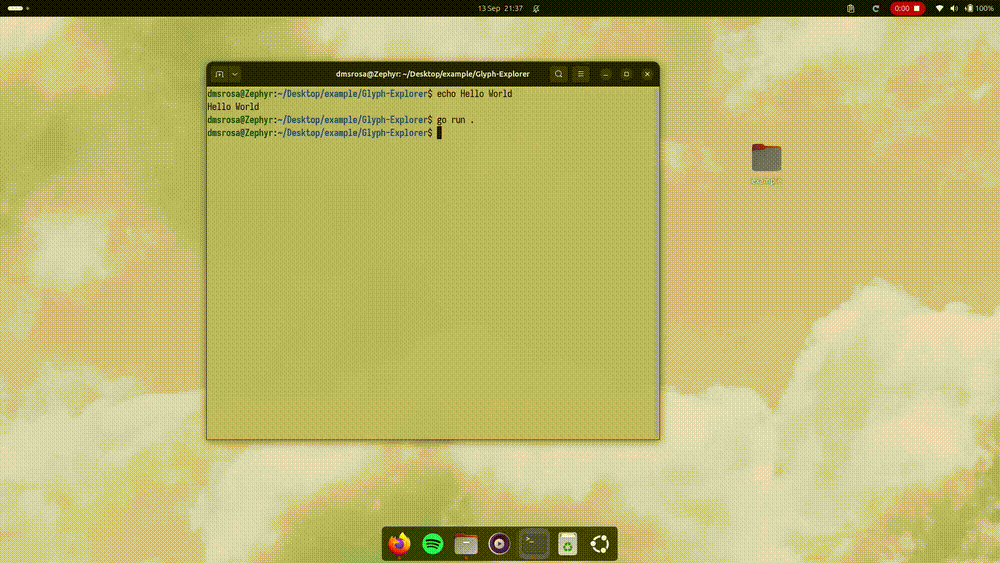

# Glyph-Explorer

A small terminal file explorer built as a reference application for the **[Glyph](https://github.com/dmsRosa6/Glyph)** TUI framework.

The goal is not to be a full-featured file manager; it's more like an exercise to try the framework :). Glyph-Explorer is deliberately small, but it exercises a useful cross-section of Glyph:

- application lifecycle
- keyboard input and key bindings
- containers and layout
- borders and styling
- dynamic widget children
- selection and scrolling
- filesystem-driven state
- status/error feedback
- terminal-safe external file opening

## Run

From this directory:

```bash
go run . [path]
```

Examples:

```bash
go run .
go run . ~/Downloads
```

## Controls

| Key           | Action              |
| ------------- | ------------------- |
| `↑` / `k`     | Move up             |
| `↓` / `j`     | Move down           |
| `Enter` / `l` | Open directory/file |
| `←` / `h`     | Parent directory    |
| `Backspace`   | Parent directory    |
| `g`           | First entry         |
| `G`           | Last entry          |
| `.`           | Toggle hidden files |
| `q`           | Quit                |

## Structure

```text
./
├── main.go          # Glyph application wiring + input bindings
├── explorer.go      # Explorer state and filesystem navigation
├── filesystem.go    # Filesystem primitives
├── view.go          # Glyph UI and row rendering
└── README.md
```

## Known Issues

* Terminal window resizing does not currently propagate through the entire application tree. This is a known issue and has already been reported in the [Glyph](https://github.com/dmsRosa6/Glyph) project.


## Demo



